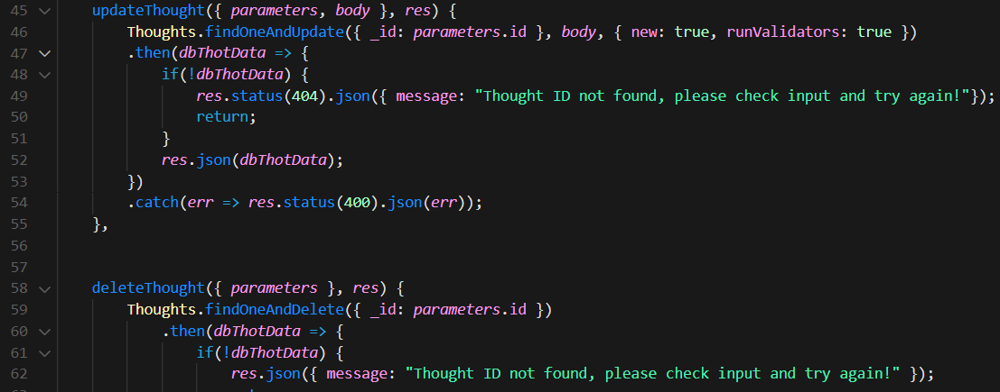

# Social Spider Web
  
## Description
Social Spider is an application that allows the user to create an account and share their thoughts. They can also add friends to view and react to their thoughts. This is all achieved via api routing using node packages./

## User Story
* AS A social media startup

* I WANT an API for my social network that uses a NoSQL database

* SO THAT my website can handle large amounts of unstructured data

## Table of Contents
- [Built With](#languages)
- [Source Code Screenshot](#Code)
- [Installation](#Install)
- [Usage](#Usage)
- [Contribution](#contributing)
- [Questions](#questions)

## Built With
* JavaScript

## Source Code Screenshot

## Installation

* Express
* Mongoose

## Usage
To use this app, simply clone the repo to your local machine and run 'npm run dev' in the terminal/root directory. Open insomnia to test the routes.

Watch my Walkthrough video testing the API routes [HERE:](https://watch.screencastify.com/v/dzoAjYUxhKtnkp6xs4SJ)

## Contribution
- This project was made by Evan Carlson and contains references and material learned in the University of Minnesota Web Dev Bootcamp.

No Contributions are being accepted at this time.

## Questions
If you have any questions on this application, feel free to reach me through my GitHub profile [epc318](https://github.com/epc318) or [E-mail](carl4917@umn.edu):

### ©️2022  Social Spiders, Inc.